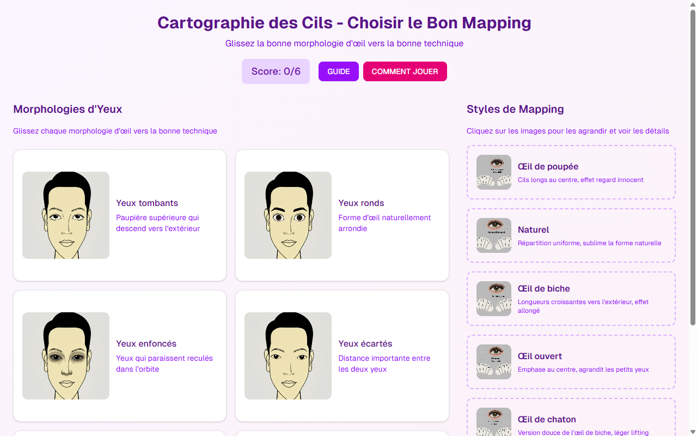

# Jeu de Mapping des Cils — Extension de Cils Slide 5

**Course:** Extension de Cils  
**Slide:** 5  
**Live URL:** https://morpholo.edtechiecorp.com  
**Stack:** Next.js · Tailwind CSS · TypeScript · GitHub Pages  

## What this slide does

An interactive lash mapping game where learners practice matching eyelash extension lengths and styles to different eye shapes. The game reinforces morphological analysis skills — a critical competency for lash technicians who must assess each client's eye shape before selecting the correct lash design. Positioned at slide 5, it follows the theory content and gives learners a chance to apply what they've learned in an engaging, game-based format.

## Screenshot

## Usage

This slide is embedded as an iframe inside Coassemble at the live URL above. DNS is managed via Cloudflare (`edtechiecorp.com`). To update the slide, push to the `main` branch — GitHub Actions will rebuild and redeploy automatically.
